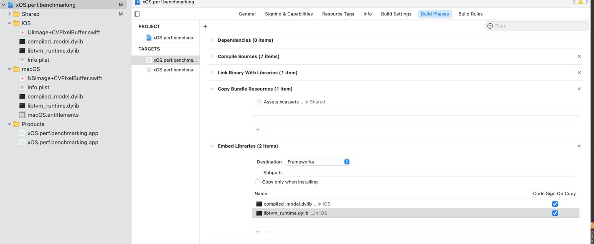

Using Swift and Apache TVM to develop ML apps for the Apple ecosystem
=============================

This tutorial illustrates how Swift can be combined with the cross OS/hardware benefits of Apache TVM. 

We’ll use the Python API to convert the model into TVM’s format. 
Finally for deployment and inference, although no official Swift API exists for Apache TVM, 
we can wrap TVM’s C++ Runtime API to plug into our Swift application. 

Package structure:
```
Swift-TVM-integration/
 + xOS.perf.benchmarking/        - iOS/macOS application folder
    + iOS/                       - iOS specificc code
    + macOS/                     - macOS specific code    
    + Shared/                    - shared TVM integration code, logic, UI    
    
 + statistic/                    - Pre collected tuning statistic
 
 + swift_tvm_prep_model.py       - Script to download and compile model
 + README.md
```

### Prerequisites: Install and Compile Apache TVM 

To build [Apache TVM](https://github.com/apache/tvm) from the source code follow the [instruction](https://tvm.apache.org/docs/install/from_source.html).
To build it for iOS and MacOS you should have XCode and LLVM installed. You should be able to build and run iOS application (participate in Apple Developer program or have personal Developer 
account). You should know your TEAM_ID to specify.

Here is the example of how to build TVM for MacOS and iOS. To do that install all dependencies and perform next commands:
```
$ export DEVELOPER_DIR=/Applications/Xcode.app
$ mkdir __build_macos; cd __build_macos
$ cmake .. \
  -DCMAKE_BUILD_TYPE=Release \
  -DUSE_LLVM=/usr/local/Cellar/llvm/11.1.0_1/bin/llvm-config \
  -DUSE_GRAPH_EXECUTOR=ON \
  -DUSE_CPP_RPC=ON 
$ cmake --build . --target tvm tvm_runtime
$ #
$ cd ..; mkdir __build_ios; cd __build_ios
$ cmake .. \
  -DCMAKE_BUILD_TYPE=Release \
  -DCMAKE_SYSTEM_NAME=iOS \
  -DCMAKE_SYSTEM_VERSION=14.0 \
  -DCMAKE_OSX_SYSROOT=iphoneos \
  -DCMAKE_OSX_ARCHITECTURES=arm64 \
  -DCMAKE_OSX_DEPLOYMENT_TARGET=14.0 \
  -DCMAKE_BUILD_WITH_INSTALL_NAME_DIR=ON \
  -DUSE_IOS_RPC=ON 
$ cmake --build . --target custom_dso_loader tvm_runtime
```


### Compiling the model evaluation script

Run ```swift_tvm_prep_model.py```, which downloads compliles Pytorch Squeeznet1.1 model and compiles it.

Two platform specific libraries with the same name ```compiled_model.dylib``` are placed into /iOS and /macOS folders 
as result of above step.  

### Complete XCode configurations 

Copy corresponding ```libtvm_runtime.dylib``` libraries to /iOS and /macOS folders and 
bundle them to the package by configuring XCode settings 


Configure user defined variable `TVM_BUILD_DIR=..` to point to TVM build folder

You should be all set now to compile and run the app. 
